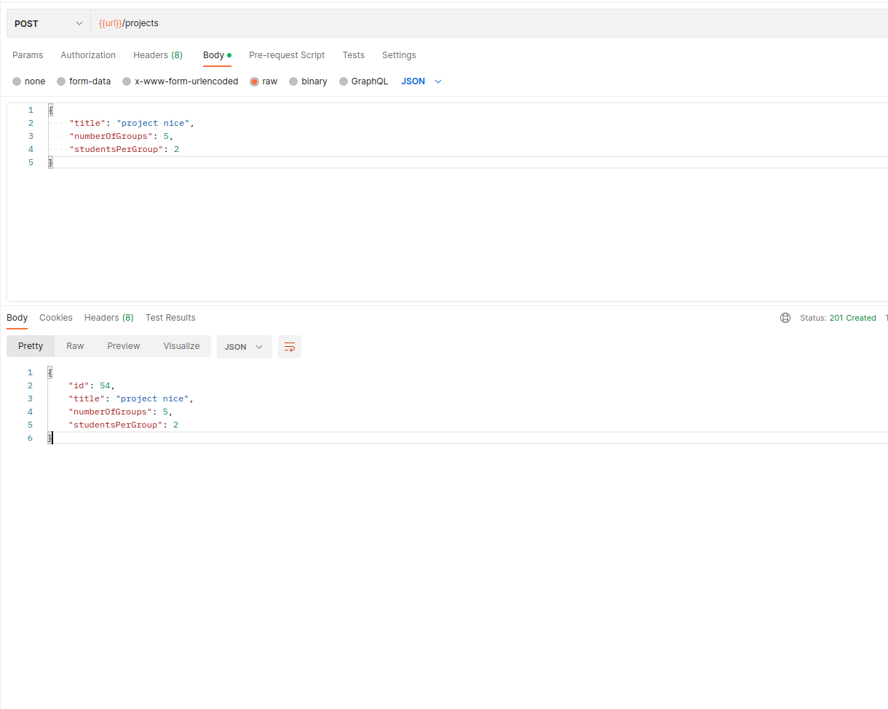
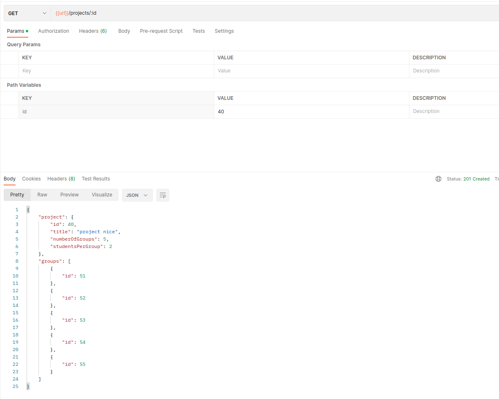

# Azeta Winter Photoshoot Project

## Project
1. Symfony version 5.4
2. php 8.1
3. mysql 5.7

### Local project set up

1. Clone project
2. To set up services run `docker-compose up -d --build`

#### Services

- PhpMyAdmin Database client: http://localhost:8081
- Project http://localhost:8080

#### Run tests (PhpUnit)

`php ./vendor/bin/phpunit tests --testdox`

functional test uses same project database (Fixtures not implemented)

### API Endpoints
Create project use `/projects` endpoint

Read created project with groups use `/projects/:id` endpoint

### technical decision
- task was created following SOLID principles
